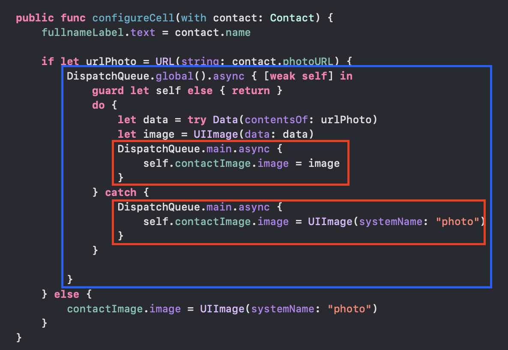

# Quais alterações eu faria no code review do PicPay

## Camada de serviço

Melhoraria o retorno de erros da aplicação, rotineiramente nos deparamos com erros que não conseguimos debugar o que é, para assegurar melhor legibilidade eu colocaria um completion com erro pra cada possibildiade de dar errado, exemplo quando nao conseguimos transformar a string em URL:

```
guard let jsonData = data else {
    completion(nil, NSError(domain: "", code: -1, userInfo: [NSLocalizedDescriptionKey: "Nenhum dado retornado"]))
    return
}

```

Adicionei o session por injeção para facilitar os testes.

## View Model

1) Se fôssemos usar alguma tática de injeção de dependências eu faria o service como uma variável e injetaria através do init, facilitando também os testes unitários posteriormente.

2) Se fôssemos usar um MVVM-C eu injetaria no coordinator.

3) Removeria a variável do completion.

4) Não criaria outra função pra handle

5) Trataria o caso do contacts vir nil

```
func loadContacts(_ completion: @escaping ([Contact]?, Error?) -> Void) {
    service.fetchContacts { [weak self] (contacts, error) in
        guard let self else { return }
        
        if let error {
            completion(nil, error)
            return
        }
        
        if let contacts {
            completion(contacts, nil)
        } else {
            completion(nil, NSError(domain: "", code: -1, userInfo: [NSLocalizedDescriptionKey: "Nenhum contaro"]))
        }
    }
}
```

## Células criadas

Para a classe de células precisei compreender melhor algumas coisas, como:

1) Como o:
```
        imgView.translatesAutoresizingMaskIntoConstraints = false

```

Funciona, que cria constraints automaticamente tentando entender o contexto da View, ou seja, quando setamos as constraints manualmente é necessário desabilitar essa propriedade.

2) contentMode
- scaleToFill: Escalar para preencher, mesmo que isso altere as dimensões da imagem para preencher a view
- scaleAspectFit: Escalar para preencher a view mantendo proporções e não podando nada
- scaleAsectFill: Escalar para preencher a view, mantendo proporção mas poda umas partes da view

3) clipsToBounds: o conteúdo que está fora da view definida será cortada sim ou não

AS MUDANÇAS DE FATO

<strong>Nessa classe eu criaria uma função para configurar a hierarquia e uma para configurar as constraints</strong>

Adicionar private nas vars pois elam devem estar abertas a edição e não modificação.

Adicionar um numberOfLines = 0 para adaptar o tamanho do label.

Adicionar um único "NSLayoutConstraint.activate" para evitar repetição de código.

Agora a parte mais difícil pra mim que é a configuração da Cell, que deve ser responsabilidade dela e pra isso eu criei o sguinte código:



Em que a parte azul está numa thread secundária para não atrapalhar a experiência do usuário visualmente enquanto carrega as imagens. A parte vermelha atualiza a thread principal com a imagem já carregada ou uma imagem qualquer.


## View Controller

1) Transformar a class UserIdsLegacy em struct pois: ela não precisa de herança, nao precisa ser tipo referencial, struct ocupa menos memória (pois é armazenado em stack e não Heap), além de não precisar se preocupar com retain cycles.

2) Criar extensions para os protocols da tableView

3) Criar uma função para hierarquia e uma para constraints

4) Colocar MARKS no código

5) No loadData eu passaria a responsabilidade de lidar com as threads para a viewModel e adicionaria um [weak self] no código


# Checklist final do projeto:

ListContactService:

[ ] Fazer ele conformar com um protocolo para facilitar os testes

[ ] Adicionaria o session por parâmetro no init

[ ] Adicionaria uma completion de erro para caso nao consiga transformar a URL

[ ] Adicionaria uma completion de erro para caso nao tenha dados


ListContactsViewModel:

[ ] Passar o service por parâmetro para facilitar testes

[ ] Deixaria sem função de handle e manteria tudo em uma função só

[ ] Passaria o manage de Dispatch

[ ] Criaria um erro completion para caso nao venha contatos


ContactCell:

[ ] Passaria o numberOfLines do fullnameLabel para 0

[ ] Separaria funções para constraints e para hierarchy

[ ] Usaria um NSLayoutConstraint.activate para ativar todas constraints de uma vez

[ ] Passaria os itens visuais para private

[ ] Criaria uma função pública de acesso a esses itens visuais.

[ ] Faria o carregamento da foto assíncrono sem ser na thread principal para evitar engasgar o app

[ ] Adicionaria uma foto default enquanto não carregasse as imagens

ListContactsViewController:

[ ] Faria o UserIdsLegacy uma Struct.

[ ] Comentaria o código

[ ] Poderia injetar a viewModel

[ ] Criaria uma função Default para showAlert

[ ] Acertaria a lógica de clique das células junto com uma "tableView.deselectRow(at: indexPath, animated: true)"
